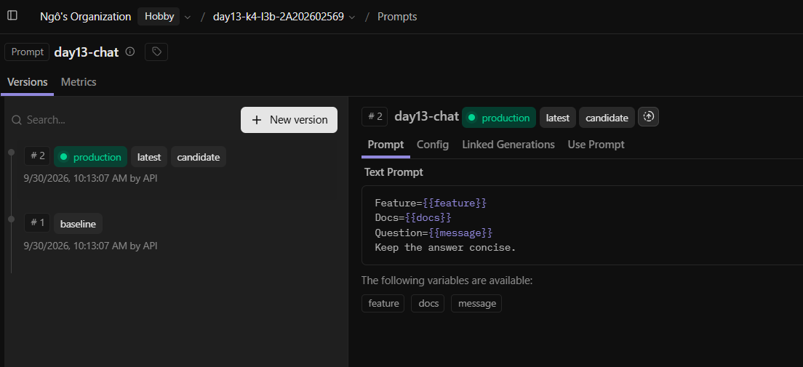
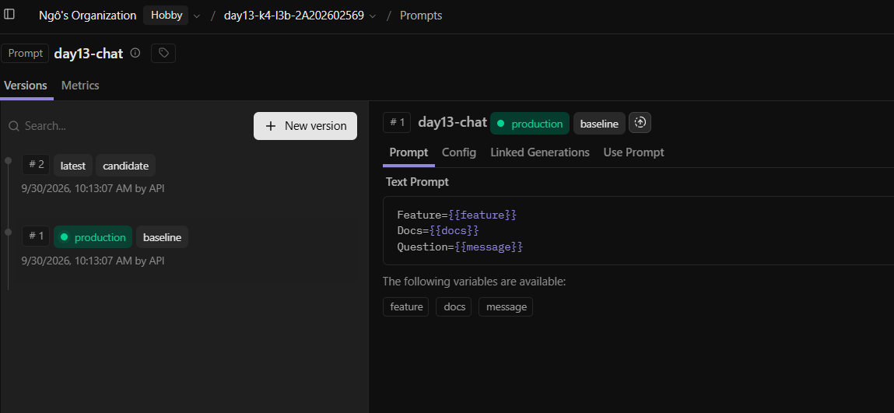
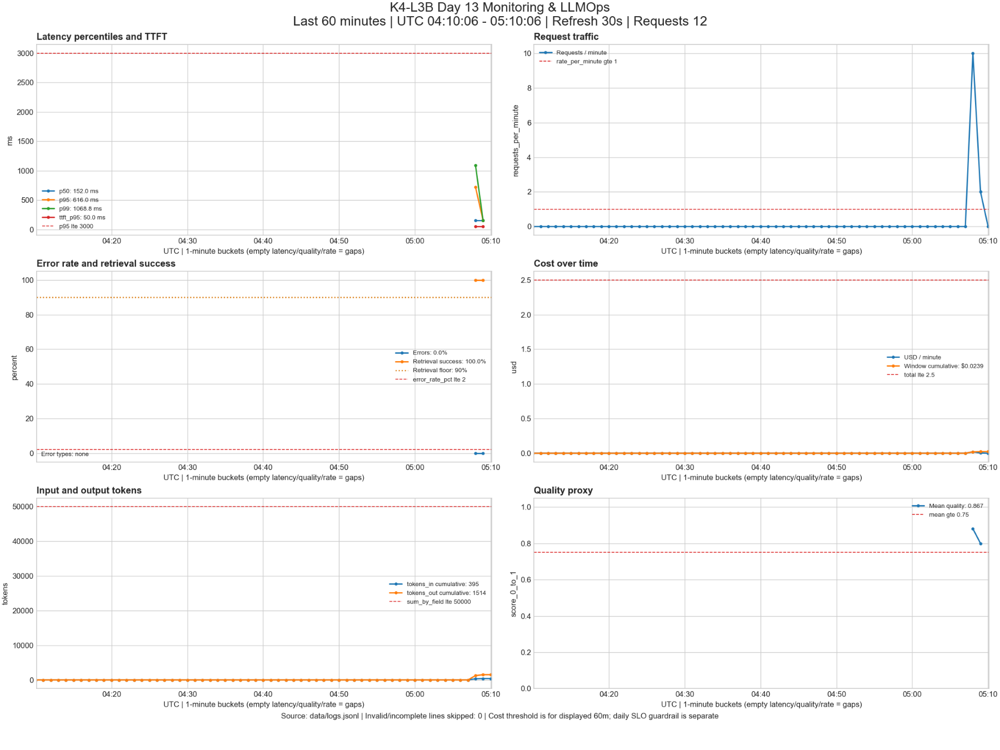
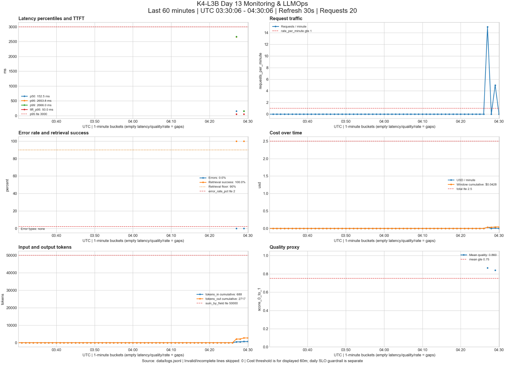
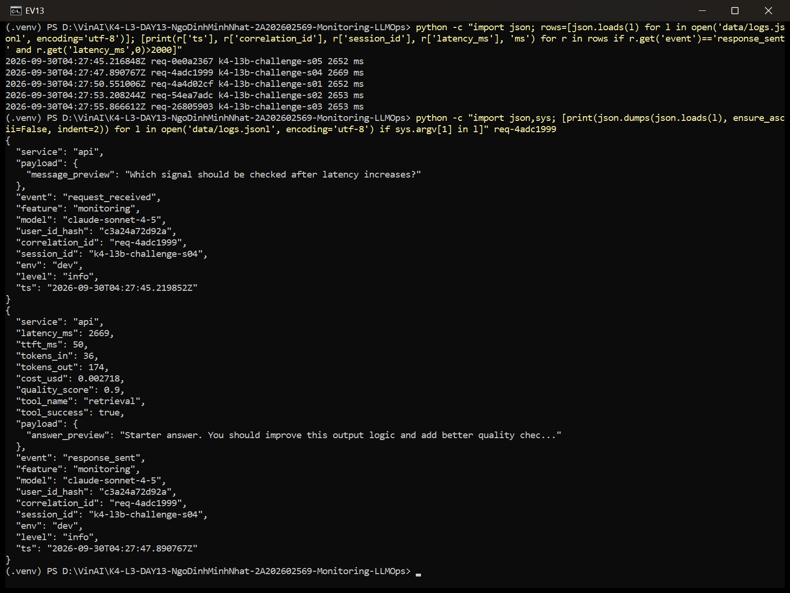
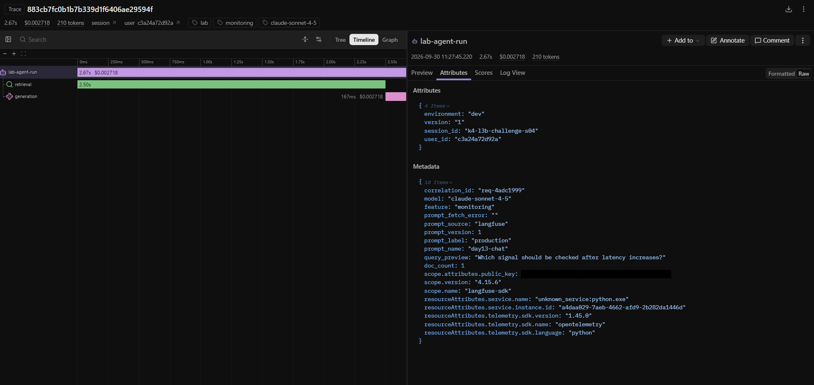

# Báo cáo cá nhân — K4-L3B Day 13 Monitoring & LLMOps

> Evidence theo hướng dẫn chụp 8.2 (01–14), tất cả là ảnh chụp runtime thật; dẫn bằng đường dẫn tương đối.

## 1. Thông tin học viên

- **Họ và tên:** Ngô Đinh Minh Nhật
- **MSSV:** 2A202602569
- **Lớp:** K4-L3B
- **Repository URL:** https://github.com/MinhNhatUet/K4-L3-DAY13-NgoDinhMinhNhat-2A202602569-Monitoring-LLMOps
- **Commit SHA cuối:** `d996b494b71ed397990defa12aecdbf1abe6453a` là commit source/config cuối (ảnh 01 chạy test tại `50e2e46`, chỉ khác report); các commit sau chỉ cập nhật `submission/`. SHA nộp LMS là commit mới nhất trên `main`.
- **Challenge ID:** `day13-k4-l3b-monitoring-llmops-v1`
- **Tên project Langfuse cá nhân:** `day13-k4-l3b-2A202602569`

## 2. Evidence index

| # | Evidence | Đường dẫn | Ghi chú đối chiếu |
|---|---|---|---|
| 01 | Pytest cuối | [01-pytest.png](evidence/01-pytest.png) | `git log -1` + 30 passed |
| 02 | Log validator | [02-log-validator.png](evidence/02-log-validator.png) | log mới sau restart, 100/100 |
| 03 | Dashboard validator | [03-dashboard-validator.png](evidence/03-dashboard-validator.png) | HỢP LỆ 6/6 |
| 04 | Structured log | [04-structured-log.png](evidence/04-structured-log.png) | `req-a4b5c6d7` |
| 05 | PII redaction | [05-pii-redaction.png](evidence/05-pii-redaction.png) | `req-b5c6d7e8` |
| 06 | Trace list | [06-trace-list.png](evidence/06-trace-list.png) | project `day13-k4-l3b-2A202602569` |
| 07 | Trace waterfall | [07-trace-waterfall.png](evidence/07-trace-waterfall.png) | trace `9d9f811d…` = request ở 04 |
| 08 | Trace metadata | [08a-trace-metadata.png](evidence/08a-trace-metadata.png), [08b-generation.png](evidence/08b-generation.png) | `correlation_id=req-a4b5c6d7`, prompt v1 |
| 09 | Prompt versions | [09-prompt-versions.png](evidence/09-prompt-versions.png) | v1 baseline/production, v2 candidate/latest |
| 10 | Promote / rollback | [10a-prompt-promote.png](evidence/10a-prompt-promote.png), [10b-prompt-rollback.png](evidence/10b-prompt-rollback.png) | production v2 → v1 |
| 11 | Dashboard overview | [11-dashboard-overview.png](evidence/11-dashboard-overview.png) | 6 panel, UTC 04:10–05:10 |
| 12 | Incident metric | [12-incident-metric.png](evidence/12-incident-metric.png) | chụp 04:30 UTC ngay sau challenge |
| 13 | Incident log | [13-incident-log.png](evidence/13-incident-log.png) | `req-4adc1999` |
| 14 | Incident trace | [14-incident-trace.png](evidence/14-incident-trace.png) | trace `883cb7fc…`, cùng `req-4adc1999` |

Giờ trong log là UTC; Langfuse hiển thị giờ Việt Nam (+7), ví dụ 05:09:24Z = 12:09:24. Dòng `scope.attributes.public_key` trong metadata các ảnh Langfuse được che đen (khóa công khai của SDK), không chỉnh nội dung khác.

## 3. Kết quả kỹ thuật

Trạng thái: CP0–CP3 hoàn thành, gồm challenge chính thức. Các số "Kết quả cuối" là lần chạy sau CP3 (log
CP3 gồm baseline, challenge và hậu kiểm; log CP0–CP2 đã chuyển ra ngoài repo trước CP3).

| Nội dung | Baseline (CP0) | Kết quả cuối | Nhận xét |
|---|---|---|---|
| `validate_logs.py` | 30/100 | 100/100 | Log mới sau khi chuyển log cũ ra ngoài và restart: 21 records, 10 unique IDs, 0 thiếu field/context, 0 PII leak ([02](evidence/02-log-validator.png)) |
| `validate_dashboard.py` | 6/6 | 6/6 | Có dashboard runtime thật ([11](evidence/11-dashboard-overview.png), [12](evidence/12-incident-metric.png)) |
| `pytest` | 22 passed | 30 passed in 2.50s | Thêm test PII, generation observability, dashboard runtime ([01](evidence/01-pytest.png)); chạy với `-p no:cacheprovider --basetemp` vì thư mục `%TEMP%\pytest-of-<user>` và `.pytest_cache` trên máy bị khóa quyền (PermissionError), không phải lỗi test |
| Số traces hợp lệ | 0 (key trống) | 173 trace trong project cá nhân (Past 1 day) | Mỗi trace có root + retrieval + generation, nối log bằng `correlation_id` ([06](evidence/06-trace-list.png)) |
| Số PII leak | 0 theo validator | 0 | Trace không capture input/output thô; chỉ preview đã scrub |
| Latency P95 / TTFT P95 | 152 ms / 50 ms | Bình thường 153 ms / 50 ms; lúc challenge 2666 ms / 50 ms | Xem mục 7 |
| Retrieval success rate | Chưa đo | 100% | Error rate 0% trong CP3 |

### Ghi nhận CP0

- Ngày chạy: 2026-09-30 (Asia/Ho_Chi_Minh), trước khi sửa code ứng dụng.
- Môi trường: Python 3.12.13 trong `.venv`; cài đủ `requirements.txt` bằng `uv pip install --python .venv/Scripts/python.exe -r requirements.txt`.
- API: `.venv/Scripts/python.exe -m uvicorn app.main:app --reload --env-file .env`.
- `/health`: `ok: true`, `tracing_enabled: false`; tất cả incident đều tắt.
- `scripts/load_test.py`: 10/10 request HTTP 200; correlation ID đang là `MISSING` (starter chưa làm CP1).
- Đã tạo `data/logs.jsonl`; validator chạy ngay sau load test và trước pytest.
- Lúc CP0 hai key Langfuse còn trống (`tracing_enabled: false`); sau đó đã tạo project `day13-k4-l3b-2A202602569`, điền key và xác nhận `tracing_enabled: true` cùng trace trên Cloud ở CP1–CP2.

## 4. Logging và PII

- **Cách tạo/nhận và truyền correlation ID:** Middleware xoá context cũ, nhận `x-request-id` hoặc sinh `req-` + 8 hex, bind context và lưu vào request.state. ID đi vào agent/trace metadata, log, response body và header; response có thêm `x-response-time-ms`.
- **Các metadata được ghi vào structured log:** `user_id_hash`, `session_id`, `feature`, `model`, `env` được bind trước `request_received`.
- **Cách bảo đảm PII được scrub trước khi ghi:** `scrub_event` xử lý chuỗi trong toàn bộ event, dictionary/list lồng nhau và exception sau khi format, trước cả JSONL file processor và JSON renderer. Giữ các pattern email, điện thoại VN, CCCD và thẻ có sẵn; bổ sung test CCCD, thẻ liền/cách/gạch nối và event lồng nhau.
- **Cách kiểm chứng kết quả:** CP1 ngày 2026-09-30: load test 10/10 HTTP 200; thêm 2 request kiểm tra ID tự sinh/ID client cung cấp. Validator đạt **100/100**, 25 records, 12 unique IDs, 0 missing fields/context, 0 PII leaks. Pytest: **27 passed in 2.91s**. Kiểm tra trực tiếp header/body/log khớp ID và timing không âm; bốn mẫu PII tổng hợp không xuất hiện trong log.
- Log CP0 đã chuyển ra ngoài repo tại `D:\VinAI\logs-cp0-baseline.jsonl` trước khi restart API. `/health` sau restart trả `ok: true`, `tracing_enabled: true`.
- Evidence: [04-structured-log.png](evidence/04-structured-log.png) (request `req-a4b5c6d7` gửi với `x-request-id` tự đặt; response trả lại cùng ID và `x-response-time-ms`; 2 khối `request_received`/`response_sent` đủ trường); [05-pii-redaction.png](evidence/05-pii-redaction.png) (`req-b5c6d7e8`, message `a@b.vn 0901234567 001099012345 4111 1111 1111 1111` được log thành `[REDACTED_EMAIL] [REDACTED_PHONE_VN] [REDACTED_CCCD] [REDACTED_CREDIT_CARD]`).

## 5. Tracing và prompt versioning

- **Cách xác nhận traces do chính tôi tạo trong project cá nhân:** Đọc Cloud observations API v2 bằng key cá nhân, đối chiếu correlation ID với `response_sent` và manifest workload. Project ID `cmunio4w70ia8ad0bwx7bq56i`. Script `scripts/verify_cp2_cloud.py` kiểm tra cây, usage/cost, prompt link và input/output null; chỉ export trường an toàn, bỏ metadata SDK chứa key.
- **Cấu trúc root/retrieval/generation observations:** Trace `day13-agent-request` chứa root AGENT `lab-agent-run`, hai child `retrieval` (RETRIEVER) và `generation` (GENERATION), cùng parent ID là root. Dùng decorator với capture_input/output=False. Generation có model, token input/output, cost input/output/total USD mô phỏng và managed prompt object qua `prompt=`.
- **Cách nối trace với log:** `correlation_id` trong metadata cả ba observation trùng response body/header và log; ví dụ request ở ảnh 04 (`req-a4b5c6d7`) là trace `9d9f811db7c1590b5abaab7b9ab46c21` ([07](evidence/07-trace-waterfall.png), [08a](evidence/08a-trace-metadata.png), [08b](evidence/08b-generation.png)); Input/Output của observation để trống ([06](evidence/06-trace-list.png)).
- **Prompt name:** `day13-chat`, loại text, đủ biến `feature`, `docs`, `message`.
- **Version/label baseline:** v1 / `baseline`; cuối workflow v1 có thêm `production`.
- **Version/label candidate:** v2 / `candidate`, thêm câu `Keep the answer concise.`; `latest` tự trỏ v2.
- **Trace ID của mỗi version:** bảng dưới đây.
- **Cách promote và rollback `production`:** Đã dời production v1 → v2 → v1 bằng Cloud API. Mỗi bước đổi label trong `.env` rồi khởi động API mới, gửi cùng câu hỏi; chờ 8 giây cho exporter trước khi dừng. Metadata trên Cloud xác nhận từng label/version; cuối cùng `.env` là production. Khi thu evidence cuối, thao tác lại trên UI: gán `production` cho v2 ([10a](evidence/10a-prompt-promote.png)) rồi trả về v1 ([10b](evidence/10b-prompt-rollback.png)); trạng thái trước đó ở [09](evidence/09-prompt-versions.png).

| Bước | Label/version | Trace ID | Correlation ID |
|---|---|---|---|
| Baseline | baseline / v1 | `9c170c6062785ad06acb2bf583722e0a` | `req-28df415d` |
| Candidate | candidate / v2 | `ad4ace5d66393ef5e798f11c14b2d30d` | `req-aeadecd0` |
| Promote | production / v2 | `2110f36c4760efba526ce475e1cc2ce4` | `req-d1c4ad0d` |
| Rollback | production / v1 | `a660c6292577df6438d3ba8d8411c1f9` | `req-607cdc80` |

Đã xác nhận **114/114 trace CP2** (342 observations) tương ứng 4 request lifecycle
và 110 request workload. Các batch chạy từ **03:13:58 đến 03:23:58 UTC ngày
2026-09-30** (10:13:58–10:23:58 giờ Việt Nam), không sửa timestamp log.
114 request CP2 dùng tổng 3894 input tokens, 15312 output tokens, cost mô phỏng
0.241362 USD, quality trung bình 0.8772. Dashboard còn chứa 12 request CP1 trong
cùng cửa sổ 60 phút nên số tổng dashboard khác riêng tập CP2. 

## 6. Dashboard, SLO và alerts

- **Dashboard và sáu panel:** `scripts/dashboard.py`, venv riêng; chạy `--serve` tại http://127.0.0.1:8501. Sáu panel latency/traffic/errors/cost/tokens/quality, đơn vị và threshold theo YAML, UTC 60 phút, refresh 30s. Retrieval denominator gồm success/failure; không traffic là N/A cho tỉ lệ. [Hướng dẫn chạy](../docs/CP2_OPERATIONS.md).
- **SLO và lý do chọn:** 99.5% request thành công và <= 3000ms trong 28 ngày. Baseline CP0 P95 152ms/TTFT 50ms; giữ dư địa cho retrieval và cold prompt fetch. Đây là mục tiêu lab, chưa chứng minh bằng sample nhỏ.
- **Cách tính error budget:** floor(10000 × (1 − 0.995)) = 50 request chậm hoặc lỗi; tối thiểu 9950 request tốt. Không đếm đôi request vừa lỗi vừa chậm. Chi tiết trong `config/slo.yaml`.
- **Ba alert và runbook tương ứng:** HighLatencyP95 (>3000ms, 5m, warning), HighRequestErrorRate (>2%, 3m, critical), LowRetrievalSuccess (<90%, 5m, warning); cửa sổ trượt 5m, ít nhất 10 mẫu, đánh giá 30s. Owner student-2A202602569; kênh dự kiến #k4-l3b-alerts. [Runbook](../docs/alerts.md) giữ anchors Alert 1/2/3, có Metrics → Logs → Traces, mitigation và hậu kiểm. Chưa triển khai scheduler/Slack webhook.

## 7. Điều tra challenge

- **Challenge ID:** `day13-k4-l3b-monitoring-llmops-v1` (cohort K4), file `config/challenge.json` do Lab Coach release trên starter, không chỉnh sửa.
- **Chuẩn bị:** chuyển log cũ ra ngoài repo, xác nhận `/health` mọi incident `false`, chạy API không `--reload`, baseline `load_test.py` 10 request.
- **Khoảng thời gian (UTC, 2026-09-30):** baseline 04:27:29–04:27:31; challenge 04:27:45–04:27:55 (5 request, concurrency 5); hậu kiểm 04:29:43.
- **Triệu chứng từ metrics** (tính từ `latency_ms` trong log, không dùng thời gian client của `load_test.py` vì request xếp hàng):

| Metric | Baseline | Challenge | Hậu kiểm |
|---|---:|---:|---:|
| Latency P50 | 152 ms | **2653 ms** | 152 ms |
| Latency P95 | 596 ms (1 request cold start 957 ms) | **2666 ms** | 153 ms |
| TTFT P95 | 50 ms | 50 ms | 50 ms |
| Error rate / retrieval success | 0% / 100% | 0% / 100% | 0% / 100% |
| Tokens out TB / cost TB / quality TB | 134 / 0.002105 / 0.880 | 153 / 0.002394 / 0.840 | bình thường |

  Chỉ latency tăng khoảng 17 lần; TTFT, lỗi, token, cost, quality không đổi đáng kể, nên phần chậm thêm nằm trước khi LLM sinh token.
- **Log line và correlation ID:** `data/logs.jsonl` (bản chạy challenge, sau đó đã chuyển ra ngoài repo trước bước 02): `event=response_sent`, `correlation_id=req-4adc1999`, `feature=monitoring`, `latency_ms=2669`, `ttft_ms=50`, `tool_name=retrieval`, `tool_success=true` (request chậm nhất trong cửa sổ challenge).
- **Trace ID và span gây ảnh hưởng:** [883cb7fc0b1b7b339d1f6406ae29594f](https://cloud.langfuse.com/project/cmunio4w70ia8ad0bwx7bq56i/traces/883cb7fc0b1b7b339d1f6406ae29594f), metadata `correlation_id=req-4adc1999`, prompt `day13-chat` v1 / `production`. Root `lab-agent-run` 2.670 s; child `retrieval` (RETRIEVER) **2.502 s = 94%**; child `generation` 0.167 s, 36/174 token, cost 0.002718 USD, level DEFAULT. So với baseline: retrieval 0.000–0.001 s → 2.500–2.502 s ở **cả 5/5** trace challenge; generation giữ 0.151–0.167 s.
- **Root cause:** Retrieval (RAG) chậm thêm cố định khoảng 2.5 s mỗi request; LLM không phải nguyên nhân. Đối chiếu code sau khi có evidence: incident `rag_slow` bật `time.sleep(2.5)` trong `app/mock_rag.py` (mô phỏng vector store chậm). Vì `async def chat` gọi `agent.run` đồng bộ, lệnh chặn này còn khoá event loop: 5 request đồng thời bị xử lý tuần tự cách nhau khoảng 2.66 s, nên client thấy 8–13 s.
- **Fix action:** `python scripts/inject_incident.py --scenario rag_slow --disable`, `/health` xác nhận mọi incident `false`, chạy lại cùng workload challenge: 5/5 HTTP 200, `latency_ms` 151–153, retrieval success 100%.
- **Preventive measure:**
  1. Alert hiện tại **không bắt được** sự cố này: P95 2666 ms < ngưỡng HighLatencyP95 3000 ms. Đề xuất thêm alert theo tỉ lệ so với baseline (P95 > 3× baseline trong 5 phút) và alert riêng cho độ trễ span retrieval (P95 > 500 ms).
  2. Đặt timeout cho retrieval và fallback (trả lời không context hoặc từ cache) khi vector store chậm.
  3. Chạy tác vụ chặn ngoài event loop (endpoint `def` hoặc `run_in_threadpool`) để một dependency chậm không làm nghẽn mọi request.
  Các đề xuất 1–3 chưa triển khai; runbook Alert 1 trong [docs/alerts.md](../docs/alerts.md) áp dụng cho bước kiểm tra Metrics → Logs → Traces.

Trước khi có đề, đã practice `tool_fail` (error rate 100%, span retrieval ERROR `Vector store timeout`).

## 8. Giải thích và tự đánh giá

- **Một quyết định kỹ thuật quan trọng và lý do:** Không gửi input/output thô lên Langfuse (`capture_input/output=False`); trace chỉ mang metadata an toàn (`correlation_id`, model, feature, prompt name/label/version, token, cost) và preview đã qua `scrub_text`. Lý do: trace được lưu ở dịch vụ bên ngoài, còn người dùng có thể nhập email/SĐT/CCCD; PII scrubber trong logging không bảo vệ được dữ liệu đi qua SDK tracing. Đánh đổi: khi debug không xem được nguyên văn prompt, nên cần `correlation_id` để nối sang structured log (đã scrub) khi cần ngữ cảnh.
- **Một lỗi/blocker đã gặp:** Khi điều tra CP3, gọi `GET /api/public/traces` để tìm trace theo `correlation_id` thì nhận HTTP 410 `LEGACY_API_UNAVAILABLE_FOR_NEW_ORGANIZATION`: project tạo sau 16/09/2026 không còn dùng được API cũ.
- **Cách tìm nguyên nhân và xử lý:** Đọc thông báo lỗi (có gợi ý đường dẫn mới), chuyển sang `GET /api/public/v2/observations` với `fromStartTime`/`toStartTime` và `fields=core,basic,usage,prompt,metadata,model,trace_context`, lọc theo `metadata.correlation_id`, rồi gom theo `traceId`, cách `scripts/verify_cp2_cloud.py` đã dùng ở CP2. Blocker phụ: pytest báo `PermissionError` khi tạo `tmp_path` trong `%TEMP%`; xử lý bằng `--basetemp` trỏ tới thư mục ghi được, sau đó 30/30 test pass (không phải lỗi code).
- **Cách hiểu luồng Metrics → Logs → Traces:** Metrics trả lời "có vấn đề gì, từ lúc nào": P50 tăng từ 152 lên 2653 ms lúc 04:27:45–55 UTC, trong khi error, token, cost không đổi. Logs trả lời "request nào": lọc cửa sổ đó, chọn `req-4adc1999` với `latency_ms=2669`. Traces trả lời "bước nào": cùng `correlation_id`, span `retrieval` chiếm 2.50/2.67 s còn `generation` chỉ 0.17 s. Mỗi tầng thu hẹp phạm vi cho tầng sau; bắt đầu từ trace ngẫu nhiên sẽ không biết trace đó có đại diện cho sự cố hay không.
- **Vai trò của prompt version, token/cost, SLO hoặc rollback trong vận hành LLM:** Prompt là một phần của "code" chạy production: đổi prompt có thể làm thay đổi token, cost, latency và quality mà không cần deploy. Gắn `prompt_name/label/version` vào mọi trace giúp so sánh v1 và v2 trên cùng input, và rollback chỉ cần chuyển label `production` về v1 thay vì deploy lại. Token/cost là metric riêng của LLM vì hóa đơn tăng theo độ dài output. SLO 99.5% (≤ 3000 ms) cho error budget 50/10 000 request; sự cố challenge cho thấy ngưỡng tuyệt đối 3000 ms còn lỏng, vì latency tăng 17 lần vẫn chưa vượt SLO.
- **Điều quan trọng nhất đã học:** Một chỉ số không đổi cũng là bằng chứng. TTFT giữ 50 ms và generation giữ khoảng 0.15 s giúp loại LLM khỏi danh sách nghi vấn trước khi mở trace. Thời gian phía client có thể gây hiểu nhầm (8–13 s do xếp hàng), nên phải dựa vào `latency_ms` phía server và span.
- **Hạn chế hoặc phần chưa hoàn thành:** Alert chưa nối scheduler hoặc Slack webhook thật. Các biện pháp phòng ngừa ở mục 7 (alert tương đối, timeout/fallback retrieval, gỡ lệnh chặn khỏi event loop) mới là đề xuất. PII chỉ có 4 pattern (email, SĐT VN, CCCD, thẻ), chưa có hộ chiếu hay địa chỉ. SLO được suy từ mẫu nhỏ; cost là giá mô phỏng của fake LLM.

## 9. Checklist trước khi nộp

- [x] Kết quả và evidence thuộc commit SHA cuối.
- [x] Tất cả ảnh/output mở được bằng đường dẫn tương đối.
- [x] Có đủ evidence 01–14 theo hướng dẫn chụp.
- [x] Incident evidence nối đúng metric → log → trace.
- [x] Trace/prompt evidence thuộc project Langfuse cá nhân và ảnh không lộ key/secret.
- [x] Repository chạy lại được theo README.
- [x] Không có secret, API key, PII thô hoặc evidence của người khác/lớp khác.
- [ ] URL repo và commit SHA cuối đã được nộp trên LMS/Codelabs.
